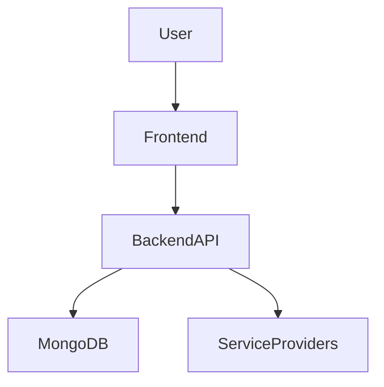

<div align="center">


# 🚀 LocalFix

### 🔧 Find Trusted Local Services Anytime, Anywhere

<p>
LocalFix helps users connect with nearby technicians, repair experts, and trusted service providers in real-time.
</p>

<br/>

<a href="https://localfix-three.vercel.app/">
  
</a>

<a href="https://github.com/alieshpatel/LocalFix">
  
</a>


<br/><br/>


</div>

---

# 🌟 About LocalFix

> **LocalFix** is a modern community-powered platform designed to solve everyday local problems quickly and efficiently.

Whether users need:

- ⚡ Electricians
- 🔧 Appliance Repair
- 🚰 Plumbing Services
- 🚗 Vehicle Assistance
- 🏠 Home Maintenance

LocalFix connects them with trusted nearby professionals instantly.

---

# ✨ Core Features

<div align="center">

| 🔍 Smart Search | 📍 Live Location | 👨‍🔧 Verified Experts |
|---|---|---|
| Find services by category, area, or availability | Detect nearby technicians in real-time | Trusted professionals with reviews |

| 💬 Community Support | 📱 Responsive UI | ⚡ Fast Performance |
|---|---|---|
| Recommendations & feedback system | Works on all devices | Optimized modern interface |

</div>

---

# 🖥️ Modern User Experience

✅ Clean UI/UX  
✅ Mobile Friendly  
✅ Real-Time Assistance  
✅ Interactive Dashboard  
✅ Community Driven  
✅ Easy Navigation  

---

# 🛠️ Tech Stack

<div align="center">

| Frontend | Backend | Database | Deployment |
|---|---|---|---|
| React, Tailwind CSS | Node.js, Express.js | MongoDB Atlas | Vercel, Render |

</div>

---

# ⚙️ System Architecture



---

# 📂 Project Structure

```bash
LocalFix/
│
├── frontend/
│   ├── assets/
│   ├── components/
│   ├── pages/
│   └── styles/
│
├── backend/
│   ├── routes/
│   ├── controllers/
│   ├── models/
│   └── middleware/
│
├── database/
├── screenshots/
├── README.md
└── package.json
```

---

# ⚡ Installation Guide

## 1️⃣ Clone Repository

```bash
git clone https://github.com/alieshpatel/LocalFix.git
```

## 2️⃣ Move into Project Folder

```bash
cd LocalFix
```

## 3️⃣ Install Dependencies

```bash
npm install
```

## 4️⃣ Run Development Server

```bash
npm run dev
```

---

# 🚀 Live Demo

<div align="center">

## 🌐 Website is Live

### 🔗 https://localfix-three.vercel.app/

<a href="https://localfix-three.vercel.app/">
  
</a>

</div>

---

# 📸 Screenshots

<div align="center">

## 🏠 Home Page


<br/><br/>

## 🔍 Service Finder


</div>

---

# 🎯 Use Cases

- 🔧 Home Appliance Repair
- ⚡ Electrician Assistance
- 🚰 Plumbing Services
- 🚗 Vehicle Breakdown Support
- 🏠 Local Home Maintenance
- 📍 Emergency Nearby Help

---

# 🚀 Future Enhancements

- 🤖 AI Service Recommendations
- 📍 Live Technician Tracking
- 💳 Secure Online Payments
- 🔔 Push Notifications
- 🌐 Multi-language Support
- ⭐ Smart Review System
- 📞 Emergency SOS Assistance

---

# 📊 Project Highlights

<div align="center">

| Feature | Status |
|---|---|
| Responsive Design | ✅ |
| Authentication | ✅ |
| REST APIs | ✅ |
| MongoDB Integration | ✅ |
| Live Deployment | ✅ |
| Real-Time Services | 🚧 |
| AI Recommendations | 🚧 |

</div>

---

# 🤝 Contributing

We welcome contributions from developers worldwide 🌍

```bash
1. Fork the repository
2. Create your feature branch
3. Commit your changes
4. Push to your branch
5. Open a Pull Request
```

---

# 👨‍💻 Developer

<div align="center">

## Aliesh Patel

💻 Full-Stack Developer  
🚀 MERN Stack Developer  
🌟 Building Real-World Solutions Through Technology

</div>

---

# ⭐ Show Your Support

If you like this project:

🌟 Star the Repository  
🍴 Fork the Project  
📢 Share with Others  

---

# 📜 License

This project is licensed under the **MIT License**.

---

<div align="center">

# 🔗 Repository Link

### 🌐 https://github.com/alieshpatel/LocalFix

<br/>

Made with ❤️ by **Aliesh Patel**

</div>
